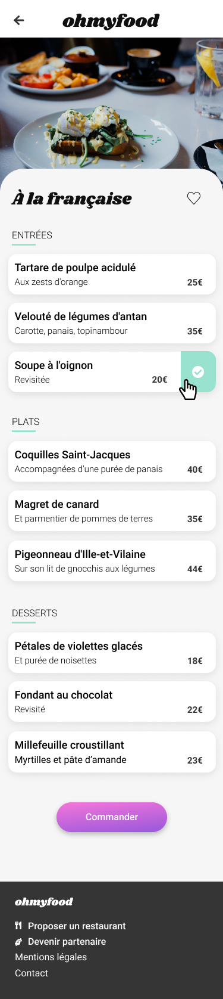
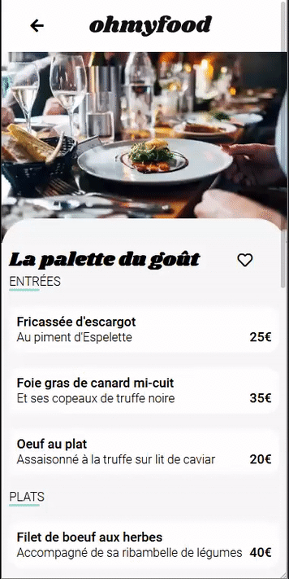

 

<h1 align="center">projet 3</h1>
 

## Introduction - Quezaco ?

"Ohmyfood !" est le troisième projet que je réalise dans le cadre de ma formation avec  **OpenClassrooms**.

Dans ce scénario, je suis développeur  web junior dans une entreprise qui propose un outil de réservation de menus.

Mon travail consiste à intégrer les maquettes graphiques en utilisant uniquement *HTML* et *CSS*, avec la possibilité d'utiliser *Sass*. Mais avant toute chose, voyons en quoi cela consiste.

***************
## Présentation - Les maquettes
Pour mener à bien ce projet, je suis parti des différentes maquettes :
1. Une page d'accueil

2. Les 4 pages menus (Elles sont construites sur le même modèle)

3. Les animations

De plus, il est demandé d'intégrer une mise en page responsive pour les tablettes et les ordinateurs, plus libre.

**************************

## Détails techniques - Les contraintes
 Voici une liste des points techniques abordés dans le briefing et qui doivent figurés dans notre projet
 * Le code doit être versionné. J'ai donc utilisé GitHub
 * La charte graphique se compose des trois couleurs suivantes :
    * *Primaire* = #9356DC
    * *Secondaire* = #FF79DA
    * *Tertiaire* = #99E2D0
* Les polices du site sont **Roboto** pour le corps et **Shrikhand** Pour les titres.
* Les icônes proviennent de la bibliotèque **Font Awesome**
* Chaque carte de restaurant doit rediriger au clic sur la page HTML qui lui est attribué.
* Une loading spinner qui dure entre 1 et 3 secondes doit être présent
* Au survol, la couleur de fond des boutons principaux devra légèrement s’éclaircir. L’ombre portée devra également être plus visible.
* À terme, les visiteurs pourront sauvegarder leurs menus préférés. Pour ça, un bouton "J’aime" en forme de coeur est présent sur la maquette. Au clic, il devra se remplir progressivement. Pour cette première version, l’effet peut être apparaître au survol au lieu du clic.
* Les animations demandées doivent être fonctionnelles sur les pages de menu.
* Le code ne doit présenter aucune erreur au validateur W3C
Il est possible d'utiliser Sass pour structurer le CSS.

************************

## Évaluation - Les critères
Les trois points principaux sur lesquels va s'axer l'évalutation de ma soutenance sont :
* Mettre en œuvre des effets CSS graphiques avancés
* Assurer la cohérence graphique d'un site web
* Mettre en place une structure de navigation pour un site web

## Conclusion - Les remerciements
Enfin, pour clore cette présentation, j'aimerais remercier mon mentor qui est toujours présent lorsque je le sollicite.

Je remercie également mes partenaires lors de cette formation, qui me permettent de me dépasser. C'est grâce à eux que je peux avancer et monter en compétence.
